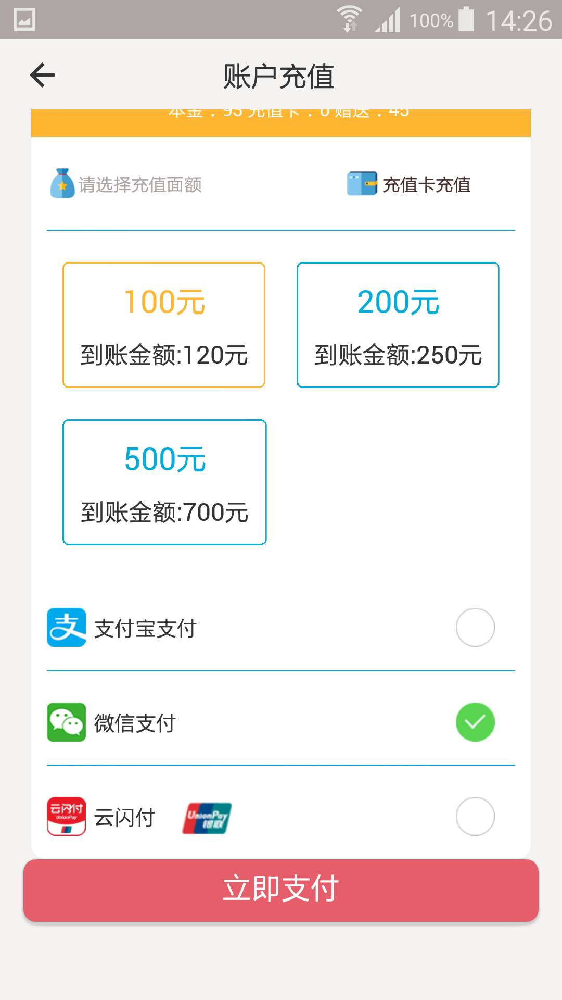
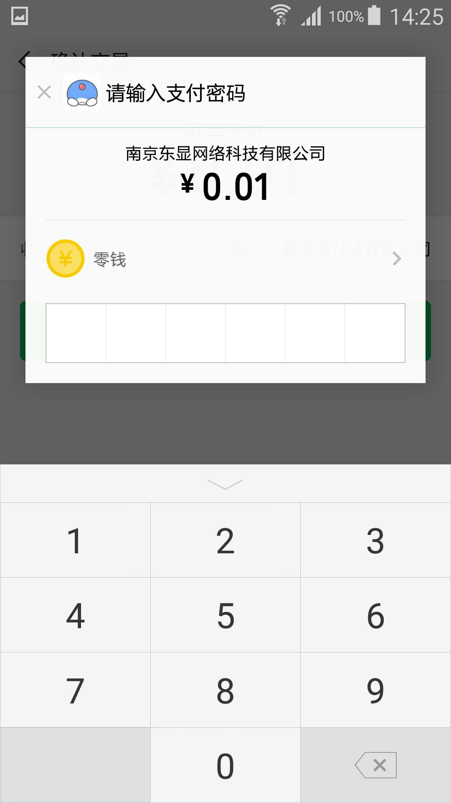
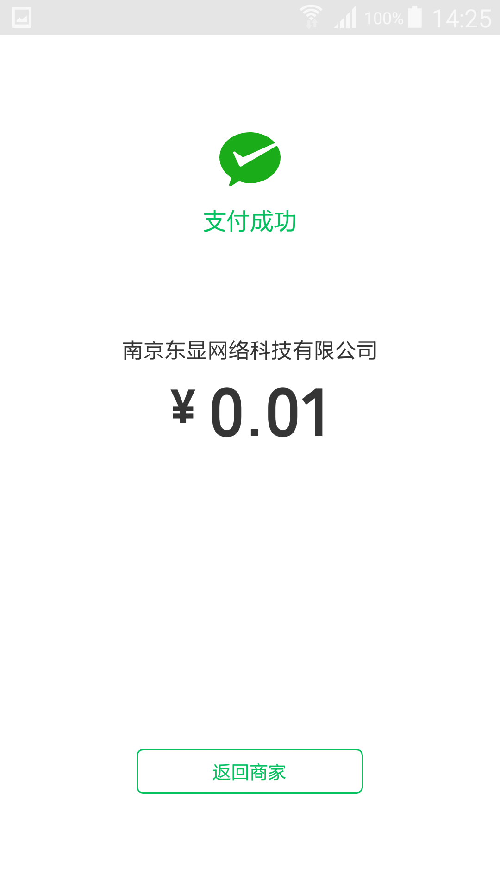
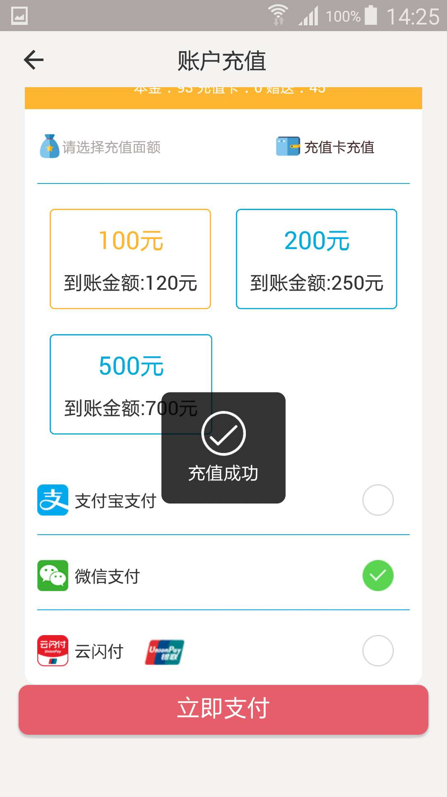
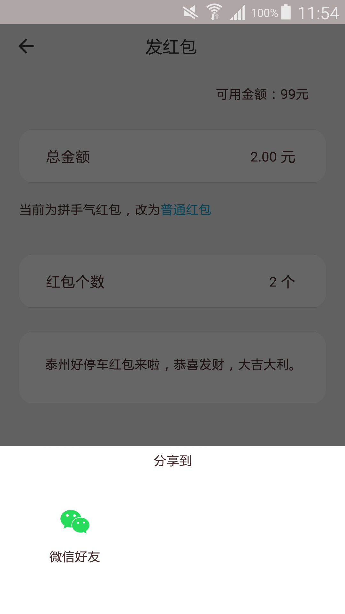
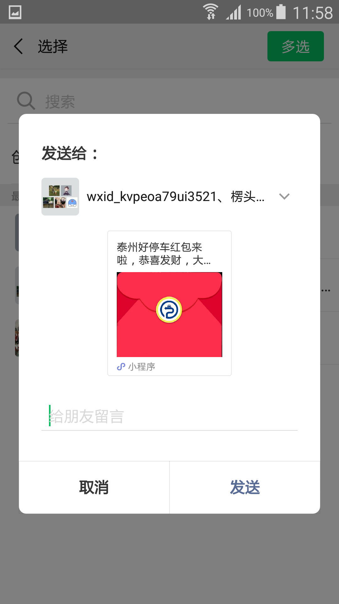
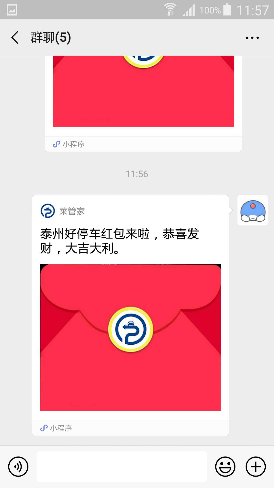

# React-Native-Wechat

[React Native] bridging library that integrates WeChat SDKs:

- [x]  iOS SDK 1.8.2
- [x]  Android SDK ++

And [react-native-wechat] has the following tracking data in open source world:

| NPM                                  | Dependency                                     | Downloads                                      | Build                                       |
| ------------------------------------ | ---------------------------------------------- | ---------------------------------------------- | ------------------------------------------- |
| [![NPM version][npm-image]][npm-url] | [![Dependency Status][david-image]][david-url] | [![Downloads][downloads-image]][downloads-url] | [![Build Status][travis-image]][travis-url] |

## Table of Contents

- [ Use Case](#use-case)
- [Effect Picture](#effect-picture)
- [Get Startted](#get-startted)
- [API Documentation](#api-documentation)
- [Installation](#installation)
- [Community](#community)
- [Authors](#authors)
- [License](#license)

## Use Case

- 微信支付
- 微信发红包功能

## Effect Picture
- 微信支付效果

<a></a>
<a></a>
<a></a>
<a></a>

- 微信分享效果

<a></a>
<a></a>
<a></a>
<a></a>

## Get Startted

- [Build setup on iOS](./docs/build-setup-ios.md)
- [Build setup on Android](./docs/build-setup-android.md)

## API Documentation

[react-native-wechat] exposes the promise-based, therefore you could use `Promise`
or `async/await` to manage your dataflow.

#### registerApp(appid)

- `appid` {String} the appid you get from WeChat dashboard
- returns {Boolean} explains if your application is registered done

This method should be called once globally.

```js
import * as WeChat from 'react-native-wechat';

WeChat.registerApp('appid');
```

#### registerAppWithDescription(appid, description)

- `appid` {String} the appid you get from WeChat dashboard
- `description` {String} the description of your app
- returns {Boolean} explains if your application is registered done

This method is only available on iOS.

#### isWXAppInstalled()

- returns {Boolean} if WeChat is installed.

Check if wechat installed in this app.

#### isWXAppSupportApi() (iOS平台)

- returns {Boolean}  Contain the result.

Check if wechat support open url.
#### isWXAppSupportApi(supportSdk) (Android平台)
```java
    //传入对应的字符串判断是否支持,没有找到微信文档,字面意思自己理解
    public static final int SDK_INT = 620824064;
    public static final int MIN_SDK_INT = 553713665;
    public static final int CHECK_TOKEN_SDK_INT = 620824064;
    public static final int TIMELINE_SUPPORTED_SDK_INT = 553779201;
    public static final int EMOJI_SUPPORTED_SDK_INT = 553844737;
    public static final int MUSIC_DATA_URL_SUPPORTED_SDK_INT = 553910273;
    public static final int PAY_SUPPORTED_SDK_INT = 570425345;
    public static final int OPENID_SUPPORTED_SDK_INT = 570425345;
    public static final int FAVORITE_SUPPPORTED_SDK_INT = 570425345;
    public static final int MESSAGE_ACTION_SUPPPORTED_SDK_INT = 570490883;
    public static final int SCAN_QRCODE_AUTH_SUPPORTED_SDK_INT = 587268097;
    public static final int MINIPROGRAM_SUPPORTED_SDK_INT = 620756993;
    public static final int VIDEO_FILE_SUPPORTED_SDK_INT = 620756996;
    public static final int SUBSCRIBE_MESSAGE_SUPPORTED_SDK_INT = 620756998;
    public static final int LAUNCH_MINIPROGRAM_SUPPORTED_SDK_INT = 620757000;
    public static final int CHOOSE_INVOICE_TILE_SUPPORT_SDK_INT = 620822528;
    public static final int INVOICE_AUTH_INSERT_SDK_INT = 620823552;
    public static final int NON_TAX_PAY_SDK_INT = 620823552;
    public static final int PAY_INSURANCE_SDK_INT = 620823552;
    public static final int SUBSCRIBE_MINI_PROGRAM_MSG_SUPPORTED_SDK_INT = 620823808;
    public static final int OFFLINE_PAY_SDK_INT = 620823808;
    public static final int SEND_TO_SPECIFIED_CONTACT_SDK_INT = 620824064;
    public static final int OPEN_BUSINESS_WEBVIEW_SDK_INT = 620824064;
```
- returns {Boolean}  Contain the result.

Check if wechat support open url.

#### getApiVersion()

- returns {String}  Contain the result.

Get api version of WeChat SDK.

#### openWXApp()

- returns {Boolean} 

Open the WeChat app from your application.

#### sendAuthRequest([scope[, state]])

- `scope` {Array|String} Scopes of auth request.
- `state` {String} the state of OAuth2
- returns {Object}

Send authentication request, and it returns an object with the 
following fields:

| field   | type   | description                         |
| ------- | ------ | ----------------------------------- |
| errCode | Number | Error Code                          |
| errStr  | String | Error message if any error occurred |
| openId  | String |                                     |
| code    | String | Authorization code                  |
| url     | String | The URL string                      |
| lang    | String | The user language                   |
| country | String | The user country                    |

#### class `ShareMetadata`

- `type` {Number} type of this message. Can be {news|text|imageUrl|imageFile|imageResource|video|audio|file}
- `thumbImage` {String} Thumb image of the message, which can be a uri or a resource id.
- `description` {String} The description about the sharing.
- `webpageUrl` {String} Required if type equals `news`. The webpage link to share.
- `imageUrl` {String} Provide a remote image if type equals `image`.
- `videoUrl` {String} Provide a remote video if type equals `video`.
- `musicUrl` {String} Provide a remote music if type equals `audio`.
- `filePath` {String} Provide a local file if type equals `file`.
- `fileExtension` {String} Provide the file type if type equals `file`.

#### shareToTimeline(message)

- `message` {ShareMetadata} This object saves the metadata for sharing
- returns {Object}

Share a `ShareMetadata` message to timeline(朋友圈) and returns:

| name    | type   | description                         |
| ------- | ------ | ----------------------------------- |
| errCode | Number | 0 if authorization successed        |
| errStr  | String | Error message if any error occurred |

These example code need 'react-native-chat' and 'react-native-fs' plugin.

```js
import * as WeChat from 'react-native-wechat';
import fs from 'react-native-fs';
let resolveAssetSource = require('resolveAssetSource');

// Code example to share text message:
try {
  let result = await WeChat.shareToTimeline({
    type: 'text', 
    description: 'hello, wechat'
  });
  console.log('share text message to time line successful:', result);
} catch (e) {
  if (e instanceof WeChat.WechatError) {
    console.error(e.stack);
  } else {
    throw e;
  }
}

// Code example to share image url:
// Share raw http(s) image from web will always fail with unknown reason, please use image file or image resource instead
try {
  let result = await WeChat.shareToTimeline({
    type: 'imageUrl',
    title: 'web image',
    description: 'share web image to time line',
    mediaTagName: 'email signature',
    messageAction: undefined,
    messageExt: undefined,
    imageUrl: 'http://www.ncloud.hk/email-signature-262x100.png'
  });
  console.log('share image url to time line successful:', result);
} catch (e) {
  if (e instanceof WeChat.WechatError) {
    console.error(e.stack);
  } else {
    throw e;
  }
}

// Code example to share image file:
try {
  let rootPath = fs.DocumentDirectoryPath;
  let savePath = rootPath + '/email-signature-262x100.png';
  console.log(savePath);

  /*
   * savePath on iOS may be:
   *  /var/mobile/Containers/Data/Application/B1308E13-35F1-41AB-A20D-3117BE8EE8FE/Documents/email-signature-262x100.png
   *
   * savePath on Android may be:
   *  /data/data/com.wechatsample/files/email-signature-262x100.png
   **/
  await fs.downloadFile('http://www.ncloud.hk/email-signature-262x100.png', savePath);
  let result = await WeChat.shareToTimeline({
    type: 'imageFile',
    title: 'image file download from network',
    description: 'share image file to time line',
    mediaTagName: 'email signature',
    messageAction: undefined,
    messageExt: undefined,
    imageUrl: "file://" + savePath // require the prefix on both iOS and Android platform
  });
  console.log('share image file to time line successful:', result);
} catch (e) {
  if (e instanceof WeChat.WechatError) {
    console.error(e.stack);
  } else {
    throw e;
  }
}

// Code example to share image resource:
try {
  let imageResource = require('./email-signature-262x100.png');
  let result = await WeChat.shareToTimeline({
    type: 'imageResource',
    title: 'resource image',
    description: 'share resource image to time line',
    mediaTagName: 'email signature',
    messageAction: undefined,
    messageExt: undefined,
    imageUrl: resolveAssetSource(imageResource).uri
  });
  console.log('share resource image to time line successful', result);
}
catch (e) {
  if (e instanceof WeChat.WechatError) {
    console.error(e.stack);
  } else {
    throw e;
  }
}

// Code example to download an word file from web, then share it to WeChat session
// only support to share to session but time line
// iOS code use DocumentDirectoryPath
try {
  let rootPath = fs.DocumentDirectoryPath;
  let fileName = 'signature_method.doc';
  /*
   * savePath on iOS may be:
   *  /var/mobile/Containers/Data/Application/B1308E13-35F1-41AB-A20D-3117BE8EE8FE/Documents/signature_method.doc
   **/ 
  let savePath = rootPath + '/' + fileName;

  await fs.downloadFile('https://open.weixin.qq.com/zh_CN/htmledition/res/assets/signature_method.doc', savePath);
  let result = await WeChat.shareToSession({
    type: 'file',
    title: fileName, // WeChat app treat title as file name
    description: 'share word file to chat session',
    mediaTagName: 'word file',
    messageAction: undefined,
    messageExt: undefined,
    filePath: savePath,
    fileExtension: '.doc'
  });
  console.log('share word file to chat session successful', result);
} catch (e) {
  if (e instanceof WeChat.WechatError) {
    console.error(e.stack);
  } else {
    throw e;
  }
}

//android code use ExternalDirectoryPath
try {
  let rootPath = fs.ExternalDirectoryPath;
  let fileName = 'signature_method.doc';
  /*
   * savePath on Android may be:
   *  /storage/emulated/0/Android/data/com.wechatsample/files/signature_method.doc
   **/
  let savePath = rootPath + '/' + fileName;
  await fs.downloadFile('https://open.weixin.qq.com/zh_CN/htmledition/res/assets/signature_method.doc', savePath);
  let result = await WeChat.shareToSession({
    type: 'file',
    title: fileName, // WeChat app treat title as file name
    description: 'share word file to chat session',
    mediaTagName: 'word file',
    messageAction: undefined,
    messageExt: undefined,
    filePath: savePath,
    fileExtension: '.doc'
  });
  console.log('share word file to chat session successful', result);
}
catch (e) {
  if (e instanceof WeChat.WechatError) {
    console.error(e.stack);
  } else {
    throw e;
  }
}

//微信支付的方法和参数
let datas = {
                                partnerId: param.partnerid,  // 商家向财付通申请的商家id
                                prepayId: param.prepayid,   // 预支付订单
                                nonceStr: param.noncestr,   // 随机串，防重发
                                timeStamp: param.timestamp.toString(),  // 时间戳，防重发
                                package: param.package,    // 商家根据财付通文档填写的数据和签名
                                sign: param.sign        // 商家根据微信开放平台文档对数据做的签名

                            };
                            Wechat.pay(datas).then((requestJson) => {
                                //支付成功回调
                                if (requestJson.errCode == "0") {
                                    //回调成功处理
                                    Toast.success('充值成功')
                                    self._refresh();
                                } else {
                                    Toast.fail('充值失败')
                                    self._cancelRecharge();
                                }
                            }).catch((err) => {
                                Toast.fail('充值失败');
                                self._cancelRecharge();
                            })
//微信发红包的方法
let url = '/pages/index/welcome/welcome?from=shareRedPacket&hbb_id=' + that.state.hbb_id
        let weixinMiniProgramShareInfo = {
            type: 'mini',
            title: that.state.titleValue,
            description: '泰州好停车',
            thumbImage:
                "https://img.zcool.cn/community/0130685c53bf4ca801203d2245c5db.png@2o.png",
            hdImageData:
                "https://img.zcool.cn/community/0130685c53bf4ca801203d2245c5db.png@2o.png",
            userName: "gh_c12c60de6e9c",
            webpageUrl: "www.baidu.com",
            miniProgramType: 0,
            path: url,//小程序页面路径
            shareTicket: false
        }
        Wechat.isWXAppInstalled()
            .then((isInstalled) => {
                if (isInstalled) {
                    Wechat.shareToSession(weixinMiniProgramShareInfo).catch((err) => {
                        console.log(err.message)
                    });
                } else {
                    Alert.alert('请安装微信');
                }
            });
```

#### shareToSession(message)

- `message` {ShareMetadata} This object saves the metadata for sharing
- returns {Object}

Similar to `shareToTimeline` but send message to a friend or chat group.

#### launchMini(params)

- `params` {Object} 打开小程序的参数

  - `userName` {String} 拉起的小程序的username

  - `miniProgramType` {Integer} 拉起小程序的类型. 0-正式版 1-开发版 2-体验版

  - `path` {String} 拉起小程序页面的可带参路径，不填默认拉起小程序首页

    

#### pay(payload)

- `payload` {Object} the payment data
  - `partnerId` {String} 商家向财付通申请的商家ID
  - `prepayId` {String} 预支付订单ID
  - `nonceStr` {String} 随机串
  - `timeStamp` {String} 时间戳
  - `package` {String} 商家根据财付通文档填写的数据和签名
  - `sign` {String} 商家根据微信开放平台文档对数据做的签名
- returns {Object}

Sends request for proceeding payment, then returns an object:

| name    | type   | description                         |
| ------- | ------ | ----------------------------------- |
| errCode | Number | 0 if authorization successed        |
| errStr  | String | Error message if any error occurred |

## Installation

```sh
$ npm install react-native-wechat --save
```

## Community

#### Tutorials

- [react-native-wechat微信组件的使用](http://www.jianshu.com/p/3f424cccb888)
- [超详细React Native实现微信好友/朋友圈分享功能-Android/iOS双平台通用](http://www.jianshu.com/p/ce5439dd1f52)
- [柳轩涤俗 - 微信登录](http://www.cnblogs.com/zhangdw/p/6194345.html)


